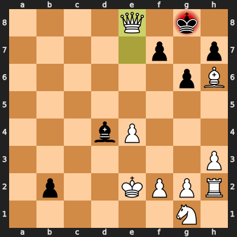

# Chess-Bot

## Overview

This project introduces chess engine capable of evaluating positions and making decisions based on neural network insights. The bot is designed with two core components: **Search** and **Evaluation**. While initially leveraging classical techniques, the project explores the integration of a neural network to improve the evaluation process, inspired by **NNUE** (Efficiently Updatable Neural Network). This NNUE implementation is simpler than the one used in Stockfish.

  

## Search

The search component is built on the **Minimax algorithm**, a fundamental decision-making algorithm in game theory that maximizes the best possible outcome for one player while minimizing the potential for the other. In chess:

- **White** aims to select moves leading to the most favorable board positions.
- **Black** aims to choose moves that minimize White's advantage, effectively maximizing its own best outcome.

## Evaluation

Initially, the bot used a hand-crafted evaluation function. This function combined piece-square tables, which capture positional values for pieces on specific squares, with the material values of each piece. While this traditional approach offered solid evaluations, it was later replaced with a neural network approach inspired by **NNUE** principles.

The NNUE (Efficiently Updatable Neural Network) approach is designed to provide a fast evaluation of board positions through a compact neural network architecture. NNUE must meet the following conditions:

1. **Sparse Inputs**  
The input vector must contain minimal non-zero elements. For our model, the input layer size is set to **768**. Each position on the board is represented by a tuple, **(piece_square, piece_type, piece_color)**, yielding 768 inputs (64 squares × 6 piece types × 2 colors). Given that a chessboard has at most 32 pieces, only a small portion of the input layer is active at any given time.

2. **Minimal Change in Inputs**  
Inputs should vary as little as possible between successive evaluations. In our implementation, at most only four inputs might change (castling).

3. **Simplicity**   
The network architecture should be small and efficient to ensure performance on CPUs. Our neural network follows a minimal structure of **768 -> 8 -> 8 -> 1** neurons. So we only have two hidden layers with eight neurons each.

## Performance & Limitations

- **Search Optimization**: A **transposition table** is used to store previously evaluated positions to avoid redundant calculations, significantly speeding up decision-making by caching results. Other techniques like **move ordering**, **null move pruning** and **futility pruning** can be employed to reduce the search space and improve performance.
- **Model Optimization**: Model quantization can be used to further improve performance however this introduces precision tradeoffs. The model can also be JIT compiled, putting it in intermediate representation which provides significant speed improvements while maintaining full precision.
- **Lack of Multithreading**: The engine currently operates in single-threaded mode, leaving potential for parallel search optimizations.
- **Language Constraints**: Python, though convenient for development, introduces some inherent performance limitations. The bot can be further optimized by exploring compiled languages like C. In this repo, some critical parts of the engine are implemented in Cython, which compiles Python-like code to C.

These performance bottlenecks represent future avenues for optimization. The bot currently has a practical search depth of **4 - 5** in live games.

## Dataset
The NNUE is trained using the [Chess FENs + Evaluations dataset](https://www.kaggle.com/datasets/dev102/chess-fens-evaluations-dataset) on Kaggle.

## References
official-stockfish. "*nnue-pytorch.*" GitHub, https://github.com/official-stockfish/nnue-pytorch.

For further details, refer to the [Chess Programming Wiki](https://www.chessprogramming.org/Main_Page)
